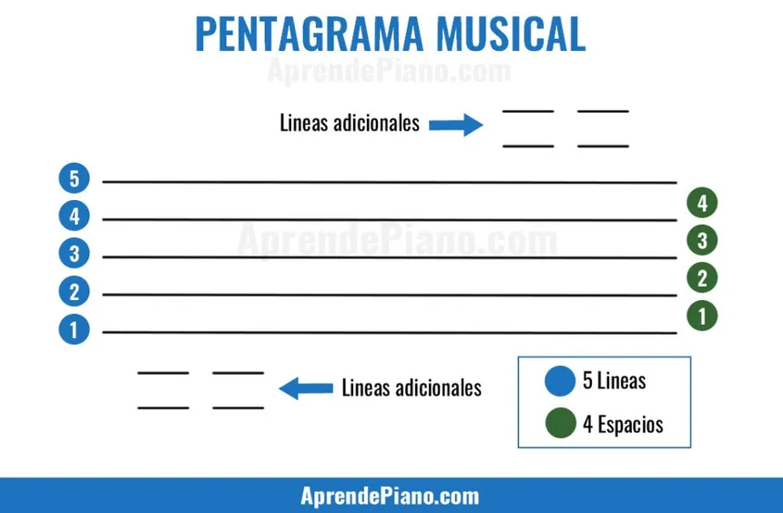

- Sonido: El sonido es vibración. El movimiento del aire produce vibraciones que estimulan el oído humano.
- Tono: El tono mide que tan grave o agudo es el sonido. Las ondas de sonido se pueden medir en vibraciones por segundo (Hz), el número de estas vibraciones determina el tono. Cuantas más vibraciones por segundo, más agudo el sonido, y mientras menos, más grave será. 
El tono se puede representar simbolicamente mediante notas, colocadas adecuadamente en lo que se acuerda es el pentagrama musical. 
 
Cuanto más baja esté la nota en el pentagrama, más grave será su tono, y viceversa. 

- Alfabeto musical